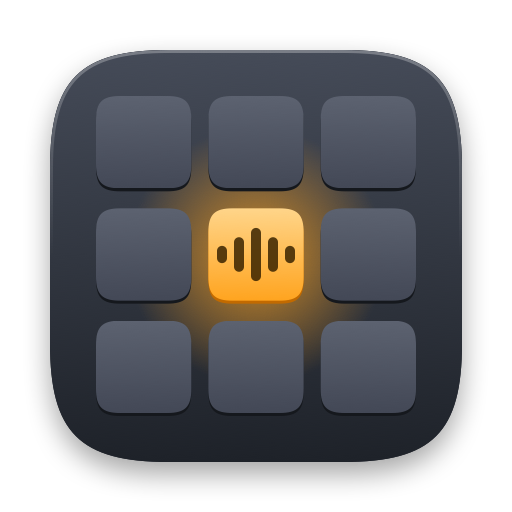
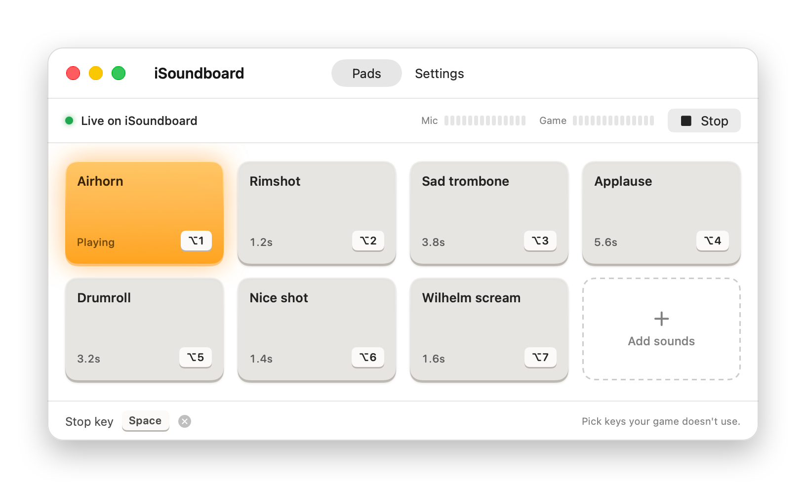
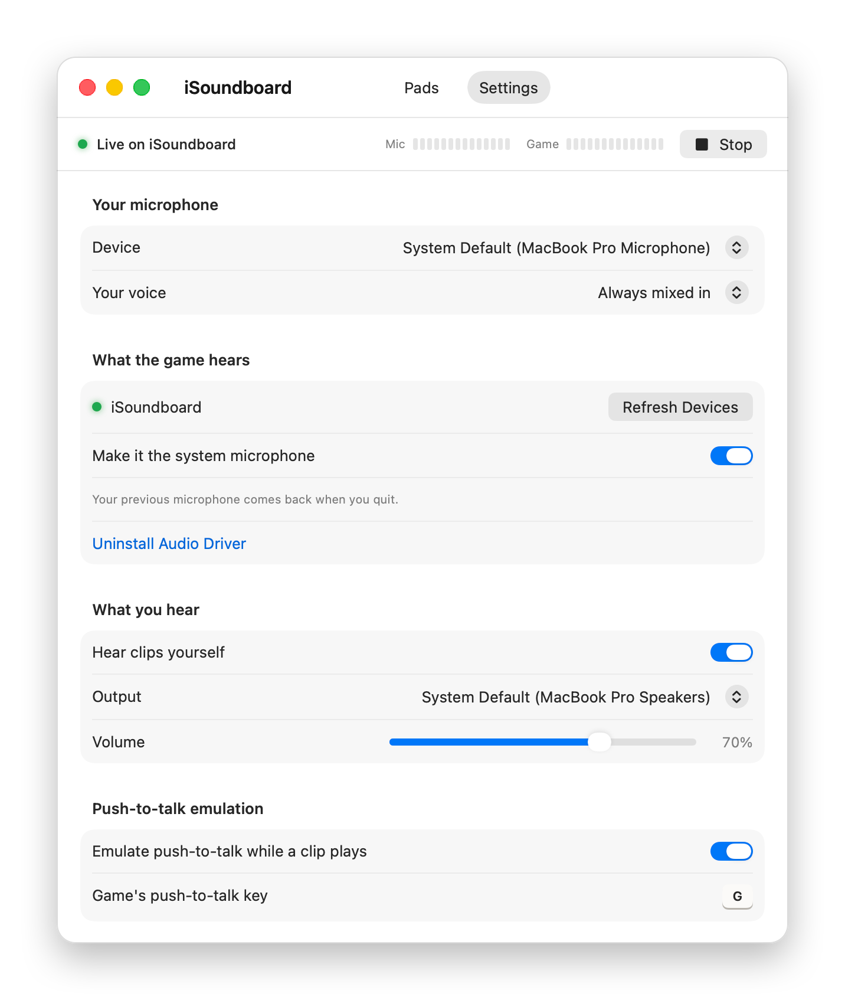

<p align="center">
  
</p>

<h1 align="center">iSoundboard</h1>

<p align="center">
  Play sound clips into game voice chat on macOS.<br>
  Your teammates hear the clip and your voice together.
</p>

<p align="center">
  <a href="https://github.com/isntaname/isoundboard/actions/workflows/ci.yml"></a>
  <a href="https://github.com/isntaname/isoundboard/releases/latest"></a>
  <a href="LICENSE"></a>
</p>

<p align="center">
  <a href="https://github.com/isntaname/isoundboard/releases/latest"><b>Download</b></a>
  &nbsp;·&nbsp; macOS 14 or later &nbsp;·&nbsp; Apple silicon and Intel
</p>

<p align="center">
  <picture>
    <source media="(prefers-color-scheme: dark)" srcset="docs/images/pads-dark.png">
    
  </picture>
</p>

## How it works

Games record from one microphone. iSoundboard mixes your real microphone and
your clips into a virtual one, and the game records from that:

```
your microphone ──┐
                  ├──▶ iSoundboard ──▶ iSoundboard driver ──▶ game voice chat
sound clips ──────┘
```

Each clip gets a hotkey that works while the game is focused. The game still
receives the key, so a hotkey never swallows an in-game action.

## Install

**1. Download iSoundboard** from
[Releases](https://github.com/isntaname/isoundboard/releases/latest), open the
`.dmg` and drag iSoundboard to Applications.

**2. Open it, then allow it.** Releases aren't notarized by Apple yet, so on
first launch macOS says it can't verify the app. Click **Done**, then open
**System Settings → Privacy & Security**, scroll down, click **Open Anyway**
and confirm.

**3. Click Install Audio Driver** and enter your Mac password. The driver is
the virtual microphone your game records from. Sound cuts out for a second
while macOS loads it.

<details>
<summary><b>About the audio driver: what it is and what installing it does</b></summary>

<br>

**What it is.** A virtual audio device named **iSoundboard**, with 2 inputs
and 2 outputs. iSoundboard plays into it, and your game records from it. It
is [BlackHole](https://github.com/ExistentialAudio/BlackHole), the
open-source driver by Existential Audio, built from source under our own
name. The source is in [`Driver/BlackHole`](Driver/BlackHole), unmodified;
what the build changes is listed in [`Driver/README.md`](Driver/README.md).

**Where it goes.** `/Library/Audio/Plug-Ins/HAL/iSoundboard.driver`. macOS's
audio service loads every driver in that folder, so the device shows up for
all apps and all users on the Mac.

**Why it needs your password.** That folder belongs to the system; only an
administrator can write to it. The app asks once, through the standard macOS
password prompt.

**What Install does**, in order:

1. Copies the driver out of the app into a temporary folder only the system
   can write to.
2. Checks its signature: it has to be iSoundboard's driver, signed by the
   same developer as the app you're running. If anything else was put in its
   place, the install stops and your current driver stays.
3. Removes the "downloaded from the internet" flag, and hands the files to the
   system.
4. Replaces any previous copy, then restarts the macOS audio service. That
   restart is the one-second sound dropout.

**Updates.** When a new version of iSoundboard carries a newer driver,
Settings shows **Update Audio Driver**. It runs the same steps.

**Already using BlackHole 2ch?** iSoundboard works with it and won't ask you to
switch. You can still install ours from Settings; the two run side by side.

**Checking it's installed.** Open **Audio MIDI Setup** and look for
*iSoundboard*, or run:

```bash
ls /Library/Audio/Plug-Ins/HAL/
/usr/libexec/PlistBuddy -c 'Print :CFBundleVersion' \
  /Library/Audio/Plug-Ins/HAL/iSoundboard.driver/Contents/Info.plist
```

**Removing it without the app:**

```bash
sudo rm -rf /Library/Audio/Plug-Ins/HAL/iSoundboard.driver
sudo killall coreaudiod
```

**The device doesn't appear after installing.** Restart your Mac. If it is
still missing while the file is in the folder above, open an issue with your
macOS version.

</details>

**4. Grant permissions.** iSoundboard opens on its Settings tab and lists what
it's missing.

| Permission | What it's for | How |
|---|---|---|
| Microphone | Mixing your voice into the virtual mic | Allow the prompt |
| Input Monitoring | Hearing your hotkeys while a game is focused | No prompt. In System Settings click **+**, choose iSoundboard, then relaunch |
| Accessibility | Pressing the game's push-to-talk key for you | Allow the prompt |

Microphone access is optional if you set **Your voice** to Muted. Accessibility
is only needed for push-to-talk emulation.

## Use

**Add sounds** by clicking the dashed pad or dropping audio files onto the
board. Any format macOS can play works: MP3, WAV, AIFF, M4A, FLAC.

**Set a hotkey** by clicking a pad's key and pressing a key or mouse button,
with or without modifiers. Press Esc to clear it. Pick keys the game doesn't
use.

**Stop** a clip with the stop key, the Stop button or ⌘. (Command-period).
Starting another clip also stops the current one, since only one plays at a
time.

**In the game**, nothing to change. iSoundboard makes its driver the system
microphone while it runs and switches back to your own microphone when you
quit. If the game has its own input picker, choose iSoundboard there.

<p align="center">
  <picture>
    <source media="(prefers-color-scheme: dark)" srcset="docs/images/settings-dark.png">
    
  </picture>
</p>

### Settings

- **Your voice.** *Always mixed in* keeps your mic live under the clips.
  *Muted while a clip plays* cuts your mic for the length of each clip.
  *Muted* sends only clips.
- **Hear clips yourself.** Plays clips to your own speakers or headphones too.
  This volume doesn't change what the game hears.
- **Push-to-talk emulation.** If the game uses push-to-talk, a clip is silent
  unless the key is held. With emulation on, iSoundboard holds the game's
  push-to-talk key for as long as the clip plays. Set the key to the one the
  game uses.

## Troubleshooting

**Hotkeys stopped working after an update.** macOS ties Input Monitoring to
the exact build. In System Settings → Privacy & Security → Input Monitoring,
remove iSoundboard with **−**, add it again with **+**, and relaunch.

**Teammates don't hear anything.** Check that the status at the top of the
window says *Live on iSoundboard*, and that the game's voice input is the
system default or iSoundboard.

**The game ignores push-to-talk emulation.** Some games ignore generated key
presses. Turn emulation off, bind the clip to your push-to-talk key itself, and
hold the key until the clip ends.

**Clips sound muffled with Bluetooth headphones.** A Bluetooth headset's
microphone drops the whole chain, clips included, to 16 kHz. iSoundboard warns
when this happens. Use your Mac's built-in microphone and keep the headset for
listening.

**Uninstalling.** Click **Uninstall Audio Driver** in Settings, then move
iSoundboard to the Bin.

## Privacy

iSoundboard makes no network connections. Audio never leaves your Mac except
through the voice chat you send it to.

## Build from source

Requires Xcode 16 or later (the full app, for the driver).

```bash
git clone https://github.com/isntaname/isoundboard.git
cd isoundboard
./build-app.sh --install        # builds and copies to /Applications
open /Applications/iSoundboard.app
swift test
```

Always start the app with `open`. A binary launched from a terminal borrows the
terminal's permissions and misreports its own. Permissions are tied to the
code signature. The script signs with your Apple Development certificate if
it finds one, so grants survive rebuilds.

<details>
<summary><b>Building the audio driver</b></summary>

<br>

`build-app.sh` builds the driver with
[`Driver/build-driver.sh`](Driver/build-driver.sh) and puts it inside the app
at `iSoundboard.app/Contents/Library/Driver/`. The build is skipped when
nothing changed. To build only the driver:

```bash
./Driver/build-driver.sh      # -> build/driver/iSoundboard.driver
```

**Requires full Xcode**, not just the command line tools: the driver is an
Xcode project.

**What the script changes**, in a temporary copy of the source:

- Name, device name and manufacturer become *iSoundboard*. The bundle id
  becomes `io.github.isntaname.isoundboard.driver`, and the icon is ours.
  BlackHole's license asks third-party builds to rename.
- 2 channels.
- Two names hard-coded in `BlackHole.c` are pointed at ours. The script
  stops with an error if a future BlackHole changes those lines.
- The version becomes BlackHole's version plus `DRIVER_REVISION`, e.g.
  `0.7.1.2`. **Bump `DRIVER_REVISION` whenever you change how the driver is
  built.** The app offers Update Audio Driver only when the version differs.

**Signing.** The app installs only a driver signed by the same developer team
as the app itself. `build-app.sh` signs both with your Apple Development
certificate if it finds one. A free Apple ID gives you one: in Xcode, open
**Settings → Accounts**, sign in, and create an *Apple Development*
certificate. Without a certificate both are signed ad-hoc and the install
checks only the bundle id. Whether macOS loads an ad-hoc-signed driver hasn't
been tested.

**Installing your build.** Run `./build-app.sh --install`, open the app and use
the button in Settings. It installs the driver from the app you built.

**Updating BlackHole.** Replace `Driver/BlackHole` with the new release and
set `DRIVER_REVISION` back to 1.

</details>

[`docs/audio-findings.md`](docs/audio-findings.md) and
[`docs/permissions-findings.md`](docs/permissions-findings.md) record the
Core Audio and permission problems that took real debugging. Read them before
changing the audio engine.

## License

[GPL-3.0](LICENSE). The audio driver is built from
[BlackHole](https://github.com/ExistentialAudio/BlackHole) by Existential
Audio, also GPL-3.0.
